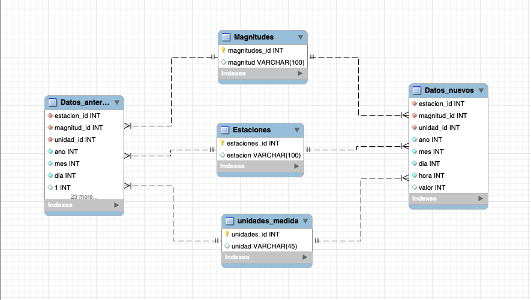

# Proyecto de ETL (Pandas, Selenium y SQL) sobre la calidad del aire de Madrid 🏙️ 
## 

Este proyecto, parte del bootcamp de Data Analytics de la escuela Ironhack, se basa en la extracción de datos sobre la contaminación del aire en Madrid para su posterior carga en una base de datos de SQL.

Los datos acerca de la contaminación entre los años 2011 y 2022 (este proyecto ha sido realizado en 2023) se han obtenido a través de la página web del ayuntamiento de Madrid. Esta nos ofrece un archivo CSV por cada mes, en el que se encuentran los datos de las medicioens de cada hora de las estaciones de medición por cada contamintante. En total se obtuvieron 133 archivos csv, que en su totalidad constaban de 646 741 filas.

El problema de la base de datos proporcionada por el ayuntamiento es que se actualiza anualmente, por lo que los datos del 2023 no aparecerán hasta el año 2024. Es por ello que, para obtener datos actualizados de la calidad del aire, se realizo un scrapeo de la página web [eltiempo.es](https://www.eltiempo.es), la cual presentada datos actualizados sobre la polución del aire en Madrid. 

Una vez terminado el proceso de recolección y transformación, dado que los csv y los datos del scrapeo se modificaron en Pandas, se cargaron dichos datos a una base de datos de SQL, con la estructura que se observa en la imagen de abajo. Además, se realizaron dos querys para probar el correcto funcionamiento de la base datos.

